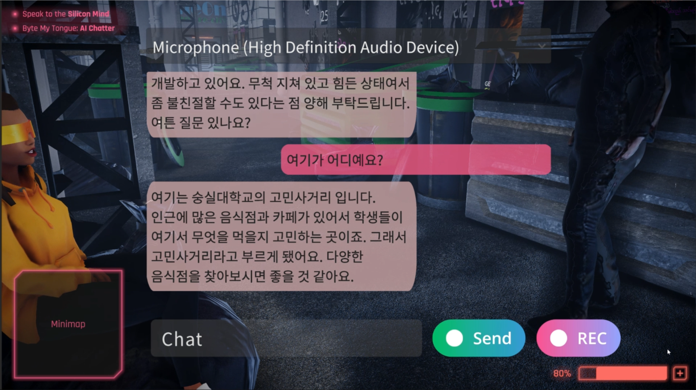

# MetaMingle: AI based metaverse character generator

## Awards🏆

- 🥇Awarded the **Grand Prize** at the 2023 SeSAC Competition, presented by the President of Soongsil University.

## Demo

### Demo Video

- [Demo Video](https://youtu.be/ANvFksJjr8I)

### Screen shots

|                          |  |
| :----------------------------------------------------------: | :---------------------------------------------------: |
| Character generator [Blender add-on](https://github.com/kwan3854/CEB_ECON) |                Texture reconstruction                 |
|                                  |                           |
|                     In-game screen shot                      |              In-game AI NPC conversation              |

## Introduction
The metaverse is rapidly growing as a new growth domain in modern society, receiving enormous investments from major companies such as Apple, Meta, and Microsoft. These companies are pointing to the metaverse as a new platform that allows users to enjoy more realistic and in-depth virtual experiences using AR and VR technologies. However, very realistic and unique character creation is an essential element in building the rich world of the metaverse.

The 'MetaMingle' project aims to provide a platform that automates the character creation process using the latest AI technology and easily generates various worldviews and characters. The project primarily focuses on helping 3D artists and planners easily access complex AI technology.

## Features
- Rapid implementation of in-game human characters based on actual photos
- Creation of new human characters
- Free customization of AI character personality/ego
- Customization of worldview

## Project Summary
- Development period: March 2, 2023 ~
- Development contents:
    - Automatic generation of human 3D character models based on wild images
        - Using **ECON** and **TEXTure paper**(stable diffusion technologies).
        - Quick implementation of in-game human characters based on photos
    - Development of **Blender plugin**
    - Character personality assignment using a **GPT-4 based** language model in the Unity engine
    - Development of AI characters that converse in a natural voice using **Amazon Polly** TTS technology
    - Development of function that moves character's mouth naturally using **Oculus lipsync** technology
    - Development of dialogue function with AI NPC characters through user's voice using OpenAI's **Whisper** AI technology
    - Development of customization features for character personality, job, background knowledge, metaverse worldview, etc.

## Codes
- [All-in-One 3D Character Generator Blender Plug-in](https://github.com/kwan3854/CEB_ECON)
- Unity Game Demo
